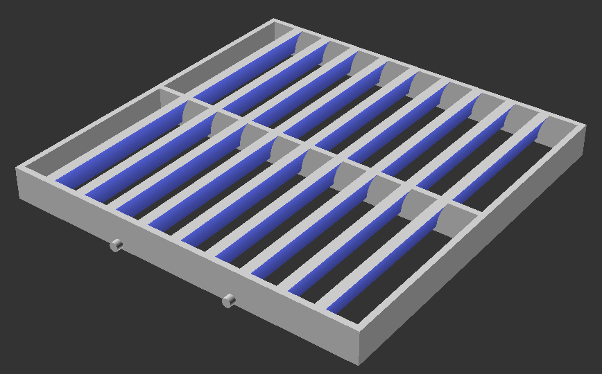
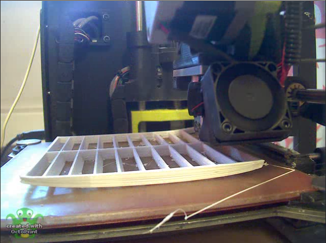
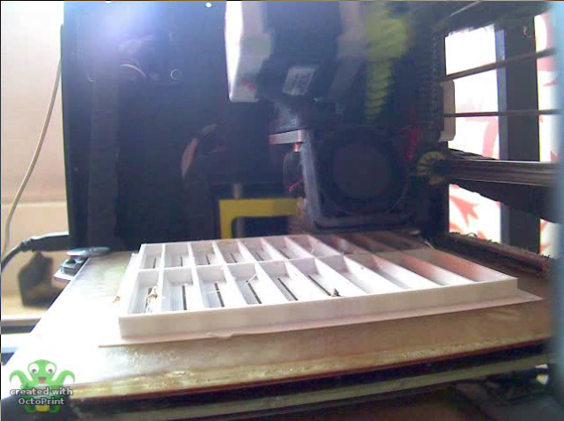

3D Printing of Vent Grilles
===========================

When I moved into a flat in the past, it had a ducted MVHR system which was missing a couple of vent grilles. The 122x122mm grilles weren't available anywhere convenient, so I decided to print my own at London Hackspace using PLA filament.

The shape of this grille is defined using OpenSCAD, an interesting declarative programming language for 3D modelling. For most things (especially this kind of simple repetitive collection of shapes with real world dimensions), I find it much more convenient and quick than using a GUI-based modeller.

There's Always (At Least) One Mistake
-------------------------------------

I needed two of these, and foolishly printed the first one without any kind of brim or raft. Predictably, with this relatively wide model, the bottom layers didn't have enough adhesion to the printer bed, and peeled up at the corners.

Interestingly, this resulted in a curvy version of the grille that still fit the frame in the wall perfectly! Nonetheless, the second version -- re-sliced with a decently wide raft generated to increase adhesion -- came out much more neatly and tidily.

- [Video of first (curved) print](readme_media/no_brim.mpg)
- [Video of second (improved) print](readme_media/with_raft.mpg)
